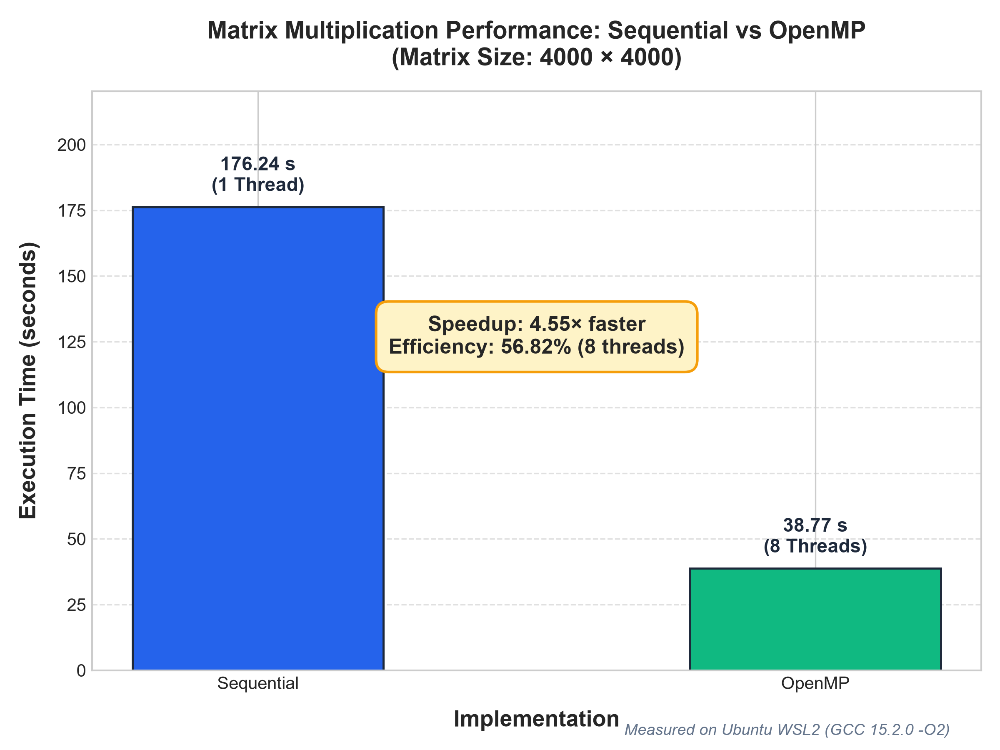
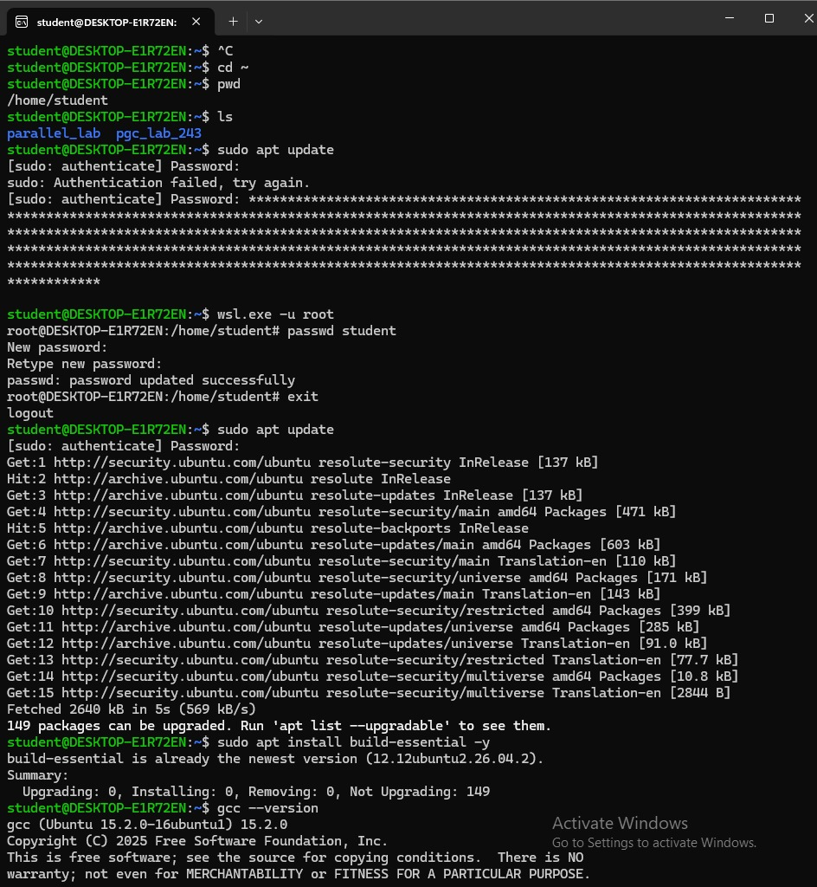
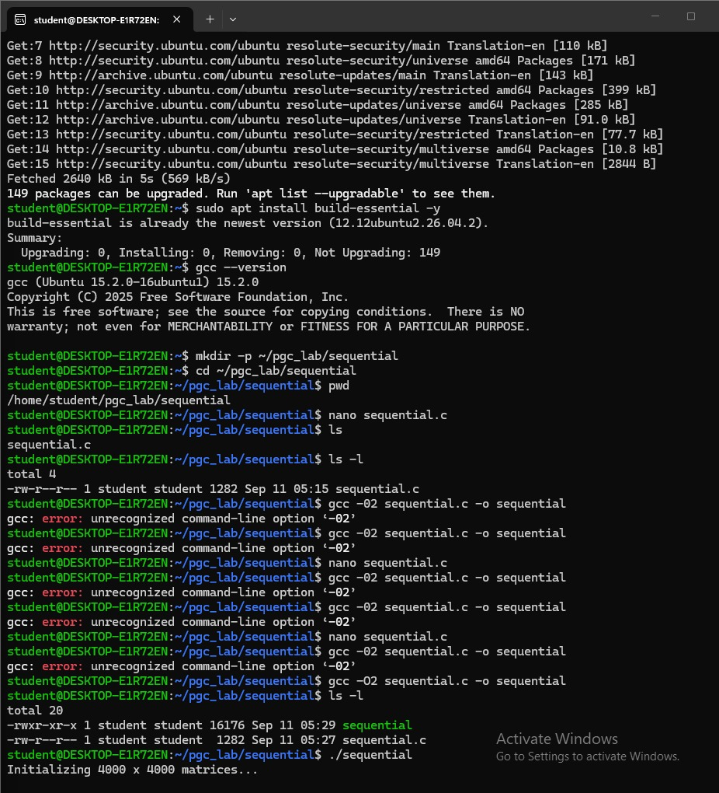
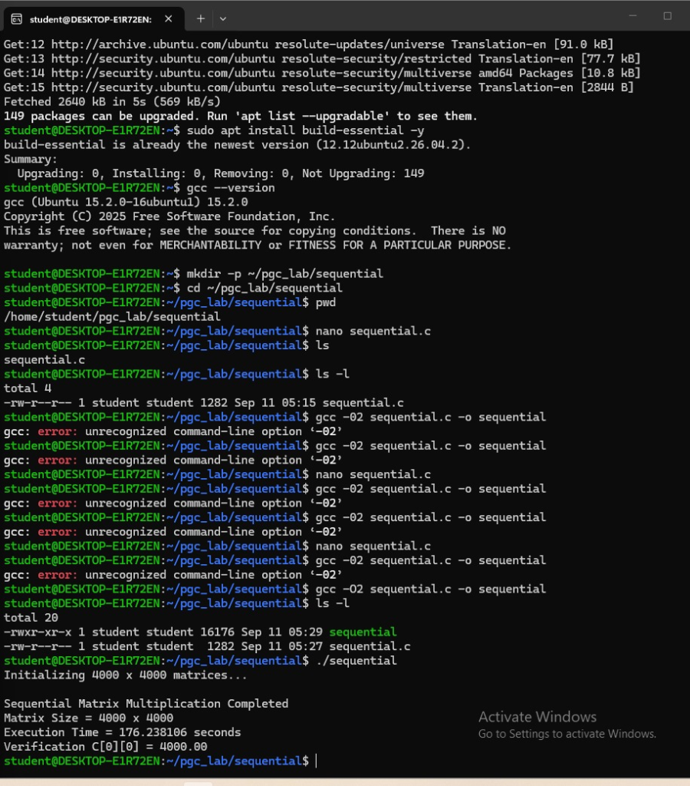
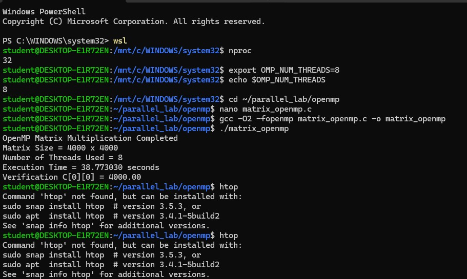
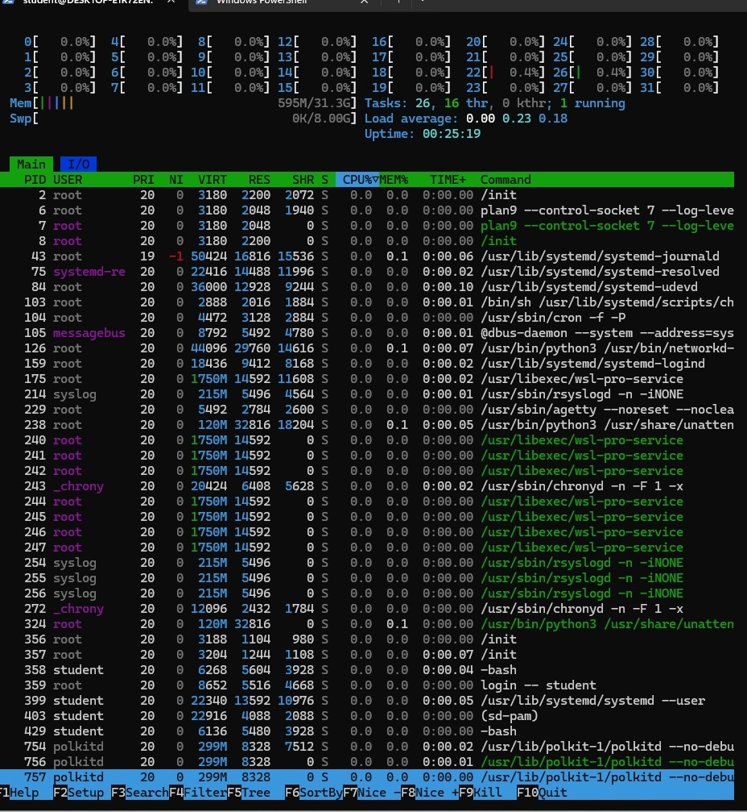
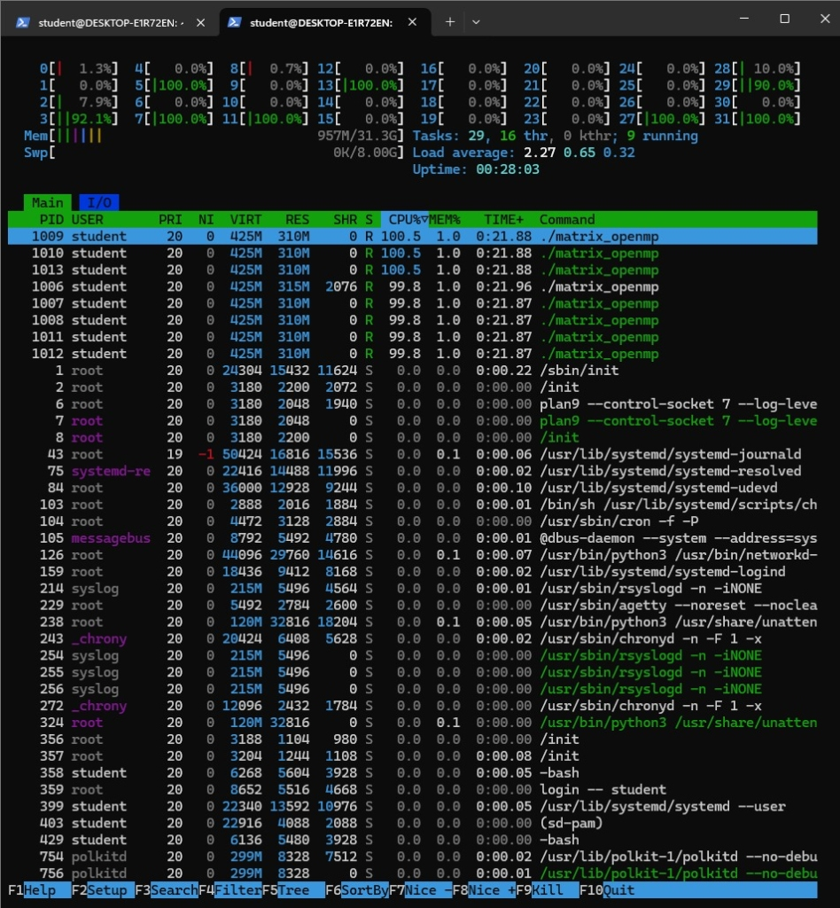

# PGC Sequential vs OpenMP Matrix Multiplication

## Introduction

This repository contains the laboratory experiment comparing CPU matrix multiplication performance across two computing models:
- **Sequential CPU Execution**: Single-threaded baseline computation.
- **OpenMP Shared-Memory Parallelism**: Multi-threaded shared-memory parallel computation across 8 CPU threads.

The Sequential implementation provides the reference baseline execution time against which parallel speedup and hardware efficiency are evaluated. The experiment strictly implements the official PGC lab manual code using dynamic heap allocation and standard three-nested loop multiplication on $4000 \times 4000$ matrices.

---

## Objective

The primary objective of this experiment is to:
1. Implement and benchmark dense $4000 \times 4000$ matrix multiplication in C using sequential CPU execution.
2. Parallelize the outer loop computation using OpenMP multi-threading across 8 threads on a shared-memory system.
3. Verify output numerical correctness ($C[0][0] = 4000.00$).
4. Empirically measure execution wall-clock time and determine the achieved **Speedup** and **Parallel Efficiency**.

---

## Problem Definition

Let $A$ and $B$ be square matrices of size $4000 \times 4000$:
$$C = A \times B$$

Every element $C[i][j]$ is calculated as:
$$C[i][j] = \sum_{k=0}^{N-1} A[i][k] \cdot B[k][j]$$

- Matrix Size ($N$): $4000 \times 4000$ elements
- Initialization: All elements of matrices $A$ and $B$ are initialized to $1.0$ ($A[i][j] = 1.0$, $B[i][j] = 1.0$), and $C$ is initialized to $0.0$.
- Expected Verification:
  $$C[0][0] = \sum_{k=0}^{3999} (1.0 \times 1.0) = 4000.00$$

---

## Technologies

- **Programming Language**: C
- **Compiler**: GCC 15.2.0 (`Ubuntu 15.2.0-16ubuntu1`)
- **Parallel Computing API**: OpenMP (via `-fopenmp`)
- **Execution Platform**: Ubuntu on WSL2 (Windows Subsystem for Linux 2)
- **Scripting & Data Analysis**: Python 3
- **Visualization**: Matplotlib & Pandas

---

## Implementations

### Sequential Implementation
The sequential program executes within a single CPU execution flow. It dynamically allocates contiguous memory for matrices $A$, $B$, and $C$, initializes them, and computes the matrix multiplication using three classic nested loops:
```c
for (i = 0; i < N; i++) {
    for (j = 0; j < N; j++) {
        for (k = 0; k < N; k++) {
            C[i * N + j] += A[i * N + k] * B[k * N + j];
        }
    }
}
```
Timing is captured via `clock()` from `<time.h>`.

- **Source File**: [`sequential/matrix_sequential.c`](sequential/matrix_sequential.c)

### OpenMP Implementation
The OpenMP implementation parallelizes the computationally intensive outer loop across 8 shared-memory threads:
```c
start = omp_get_wtime();
#pragma omp parallel for private(j, k)
for (i = 0; i < N; i++) {
    for (j = 0; j < N; j++) {
        for (k = 0; k < N; k++) {
            C[i * N + j] += A[i * N + k] * B[k * N + j];
        }
    }
}
end = omp_get_wtime();
```
- **Thread Safety**: Variables `j` and `k` are declared `private` to ensure each thread operates on independent indices without race conditions.
- **Shared Access**: Matrices $A$, $B$, and $C$ reside in shared memory. Since each thread calculates distinct rows $i$, write operations to $C$ require no mutual exclusion locks or critical sections.
- **Timing**: High-resolution wall-clock timing is measured with `omp_get_wtime()`.

- **Source File**: [`openmp/matrix_openmp.c`](openmp/matrix_openmp.c)

---

## Project Structure

```text
PGC-Parallel-Computing-Comparison/
│
├── README.md
├── .gitignore
│
├── sequential/
│   └── matrix_sequential.c
│
├── openmp/
│   └── matrix_openmp.c
│
├── results/
│   ├── execution_times.csv
│   ├── performance_comparison.png
│   └── screenshots/
│       ├── sequential/
│       │   ├── sequential_output_1.png
│       │   ├── sequential_output_2.png
│       │   ├── sequential_output_3.png
│       │   └── sequential_output_4.png
│       └── openmp/
│           ├── openmp_output_1.png
│           ├── openmp_output_2.png
│           └── openmp_output_3.png
│
├── scripts/
│   └── generate_graph.py
│
└── docs/
    └── experiment_notes.md
```

---

## Experimental Setup

The hardware and software environment details captured from the experimental runs:

| Parameter | Value |
|---|---|
| Matrix Size | 4000 × 4000 |
| Sequential Threads | 1 |
| OpenMP Threads | 8 |
| Compiler | GCC 15.2.0 |
| Optimization Flag | `-O2` |
| Platform | Ubuntu on WSL2 |
| Logical CPU Cores Available | 32 |

---

## Performance Results

Measured execution metrics obtained from experimental runs:

| Implementation | Matrix Size | Threads | Execution Time | Speedup | Efficiency |
|---|---|---:|---:|---:|---:|
| **Sequential** | 4000 × 4000 | 1 | **176.238106 s** | **1.00×** | **100.00%** |
| **OpenMP** | 4000 × 4000 | 8 | **38.773030 s** | **4.55×** | **56.82%** |

---

## Performance Graph

The performance chart comparing execution times is automatically generated from `results/execution_times.csv`:



---

## Output Screenshots

### Sequential Output

Terminal output evidence showing environment verification, GCC 15.2.0 compilation, execution, and verification:

#### 1. System Setup & GCC 15.2.0 Verification


#### 2. Compilation and Execution Run


#### 3. Detailed Compiler Setup View


#### 4. Execution Completion & Verification


---

### OpenMP Output

Terminal output evidence showing thread configuration (`OMP_NUM_THREADS=8`), compilation with `-fopenmp`, execution time, and `htop` multi-core thread load:

#### 1. OpenMP Setup, Compilation & Execution (38.77 s)


#### 2. Process Monitor Overview (`htop`)


#### 3. Multi-Core Utilization (`htop` 8 Active Threads at 100% CPU)


---

## Verification

Both programs verified output numerical correctness upon execution:
```
Verification C[0][0] = 4000.00
```
This confirms that the first element of matrix $C$ correctly matches the expected dot product sum of 4000 terms ($\sum_{k=0}^{3999} 1.0 \times 1.0 = 4000.00$).

> **Verification Notice**: Checking $C[0][0] = 4000.00$ serves as a quick program execution sanity check confirming that the loops and memory addressing completed properly without segfaults or data corruption. It does not strictly mathematically prove that every one of the $16,000,000$ matrix elements is accurate, though the uniform algorithm indicates deterministic computation.

---

## Performance Metrics

### Execution Time
- **Sequential Runtime**: `176.238106` seconds (~2.94 minutes) executing sequentially on 1 CPU thread.
- **OpenMP Runtime**: `38.773030` seconds (~0.65 minutes) executing in parallel across 8 CPU threads.

### Speedup
Speedup evaluates the factor by which computation is accelerated using parallel processing:
$$\text{Speedup} = \frac{T_{\text{Sequential}}}{T_{\text{OpenMP}}} = \frac{176.238106}{38.773030} \approx \mathbf{4.55\times}$$

### Parallel Efficiency
Efficiency measures the percentage of theoretical computational capacity utilized across the allocated threads:
$$\text{Efficiency} = \frac{\text{Speedup}}{\text{Number of Threads}} \times 100\% = \frac{4.54535}{8} \times 100\% \approx \mathbf{56.82\%}$$

**Analysis**:
The parallel efficiency of $56.82\%$ represents solid shared-memory speedup for dense matrix multiplication without cache-blocking (tiling). Memory bandwidth contention on column-stride reads ($B[k \times N + j]$) and thread synchronization are the primary factors preventing ideal $8.00\times$ linear scaling.

---

## Compilation and Execution

### Sequential

```bash
cd sequential
gcc -O2 matrix_sequential.c -o matrix_sequential
./matrix_sequential
```

### OpenMP

```bash
cd openmp
export OMP_NUM_THREADS=8
gcc -O2 -fopenmp matrix_openmp.c -o matrix_openmp
./matrix_openmp
```

### Generating the Performance Graph

To regenerate the comparison bar chart from the raw experimental CSV:
```bash
python scripts/generate_graph.py
```
This reads `results/execution_times.csv` and updates `results/performance_comparison.png`.